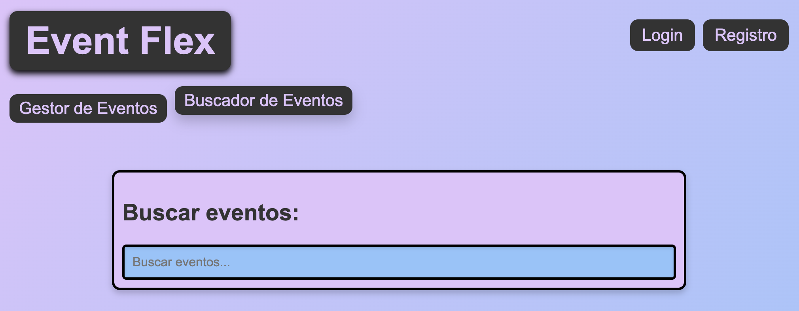

# Sistema de Gestión de Eventos - [EventFlex](https://eventeflex.netlify.app/)

# EN CONSTRUCCIÓN

## Sobre el Proyecto

EventFlex es una aplicación web para la gestión eficiente de eventos. Permite a los usuarios crear, organizar y dar seguimiento a diferentes tipos de eventos de manera intuitiva y efectiva.

## Características Principales

- Creación y gestión de eventos
- Panel de administración
- Buscador con filtros
- Interfaz responsive
- Validación en tiempo real

## Tecnologías Utilizadas

- HTML5
- CSS3
- JavaScript (Vanilla)
- LocalStorage para persistencia de datos

## Licencia

Este proyecto está bajo la Licencia MIT Si decides usar este proyecto, por favor, mencióname.

## Contacto

Si tienes alguna pregunta o sugerencia, no dudes en contactarme:

- **Email:** cardenas97vga@gmail.com
- **GitHub:** [0re0re0](https://github.com/0re0re0)
